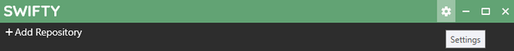
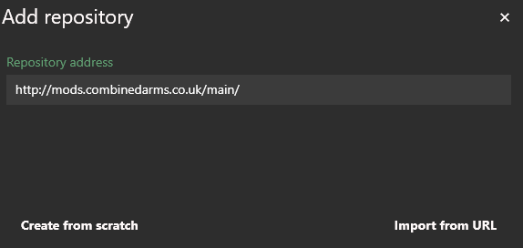
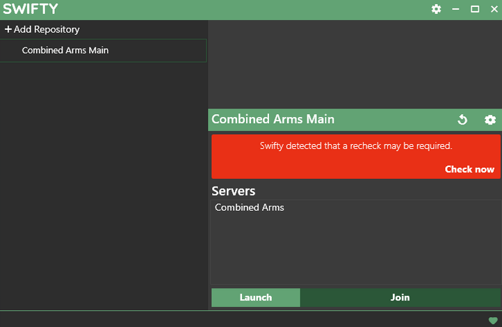
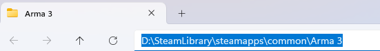

# How to Swifty

By Bubbus for CA 
With segments from the old guide by Starvolt. 

## Foreword (Why Swifty?)

Combined Arms uses Swifty instead of other approaches like Steam Workshop collections. While it’s easier to point people towards the Workshop, CA has been operating for a very long time now and has seen plenty of times where an Arma event would have had to be delayed or cancelled due to an unexpected mod update breaking the server, the mission file or both. Swifty allows us to control when mod updates happen, which means we never have any surprises.

In addition, we can run multiple mod-sets easily by separating them into different Swifty “repositories”. All of the mods can be installed into the same place so it doesn’t waste any of your storage space, and then they are all shared between our different mod-sets (Main, WW2, V+ etc).

We’ve been using Swifty since our group’s creation back in 2016 and have found it to be the best tool available so far for maintaining a complex mod-pack for a group of our size. The initial set-up can be a bit annoying but once it’s done, it’s done \- and this guide is here to help.

## Straightforward set-up guide

Swifty installation should normally be quite easy, but sometimes it can encounter some problems. The guide below will describe the ideal set-up process but if you have any problems following these instructions, you can check the [troubleshooting](#troubleshooting) section for advice.

1. Download the latest version of Swifty 3 from [getswifty.net](https://www.getswifty.net/) 

	!!! Note
		Make sure you get the Swifty Setup and not the “Swifty-cli”!

<figure markdown="span">
  { loading=lazy }
</figure>

2. Run the ``Setup.exe`` (this will install and open Swifty). 

3. By default, Swifty will be empty. Open the Settings menu in Swifty by clicking the cog icon in the upper right of the window.

<figure markdown="span">
  
</figure>

4. In the settings page, you can set the Arma 3 directory and a “Temporary directory”.

	The Arma 3 directory that you set here will be used by Swifty to find Arma and start the game with the right mods attached. If you need help finding the Arma 3 directory, follow the steps in the [find the Arma 3 directory](#find-the-arma-3-directory) section below.

	The “Temporary directory” is a place that Swifty will download mods into when it is updating: when the mods are fully downloaded then they are moved away into the proper place. Make sure that you have this directory somewhere with enough disk space.

<figure markdown="span">
  
</figure>

Your Swifty is now configured and you can start adding mod-lists (aka “repositories”).

## Adding a new mod-list (aka ‘repository’)

1. Find the repository you want to add at [Repos & CDLC page](repos_cdlc.md) and copy the link, making sure to include the http://

2. In the main swifty window, click "Add Repository", then enter the desired repo address and click "Import from URL". 

<figure markdown="span">
  
</figure>

## Repository Settings

1. Fill in the name as desired

2. The Path is where the mods will be installed. A new folder in the Arma 3 directory works well, but it is up to you.

	!!! Note
		If you are adding multiple repos, make sure they have the same path so any shared mods are not duplicated!

3. The Parameters are equivalent to setting Launch Options through Steam. The parameters shown below (-nosplash -world=empty -skipintro -noPause) will help the game boot faster, but are entirely optional. To see all available launch options, check the [Arma 3 wiki](https://community.bistudio.com/wiki/Arma_3:_Startup_Parameters).

4. Once everything is set to your liking, click the X to close the repository settings. 

<figure markdown="span">
  
</figure>

## Downloading mods

1. Click "Check now" to prompt Swifty to check what mods are missing or need to be updated (in this case, all of them). This may take a few minutes, so feel free to go make a cup of tea while you wait. 

	!!! Note
		In the future, this is also how you will update your mods if any changes are made.

<figure markdown="span">
  
</figure>

2. Once Swifty has finished checking the mods, it will prompt you to download any missing mods. Hit download, and Swifty will download and install the necessary mods/updates.

## Installing ACRE

We use ACRE2 for radios and proximity chat. It comes with a Teamspeak plugin. To install the Teamspeak plugin, open Arma once by pressing the Launch button on Swifty **while Teamspeak is closed**. This will automatically install the plugin for you. After that, it doesn't matter if Teamspeak is open or closed when you launch Arma.

You're now finished! Come mission time, hit the Join button to launch Arma and automatically join the CA server. Alternatively, the Launch button can be used to launch Arma with the mods loaded, but without connecting to the server. 

## CDLCS (Global Mobilisation, SOG, etc.)

CDLCs are additional paid content that can be loaded with the game. Missions that use them will declare so on the slotting page and in their briefing. If you have not purchased them, you may be able to join missions using compatibility data, which is installed as a client-side mod explained [below](#optional-client-side-mods). Ask the mission maker though, as not all missions will allow for this. 

If you have purchased and installed the CDLC, it must be added to your repo’s parameters in order to be launched. The easiest method is to add a new repository whenever you need a new CDLC, and edit the name to reflect it. That way, you only have to edit parameters once. 

Once you have the repository you wish to add the CDLC to, open its settings. Then, add the following to the front of the parameters, for whichever CDLC you wish to use. You can add multiple in a row if the mission calls for multiple CDLCs. 

| CDLC | Parameter |
| -------------------- | ---------- |
| Global Mobilization  | -mod=GM;   |
| SOG Prairie Fire     | -mod=vn;   |
| Western Sahara	   | -mod=ws;   |
| CSLA Iron Curtain    | -mod=CSLA; | 
| Spearhead 1944       | -mod=spe;  |
| Reaction Forces      | -mod=rf;   |
| Expeditionary Forces | -mod=ef;   |

<figure markdown="span">
  
</figure>

Here is an example of a Swifty setup that was created over time, adding repos as needed. It has repos with and without client-side mods, and additional repos for CDLCs.

<figure markdown="span">
  
</figure>

## Optional: Client-side Mods

Swifty supports adding client side mods, such as sound mods or Zeus UI mods. 

### Adding the search folder

1. Go to the general swifty settings.

2. Open the "Additional search folders" tab.

3. Click "Add new folder" and find the location of your client-side mods. If they come from the steam workshop, they will be in Arma 3\!Workshop. See [below](#find-the-arma-3-directory) for how to find your Arma 3 directory.

!!! Note
	You must launch Arma through Steam with the mods enabled at least once before they will work when launched through Swifty.

<figure markdown="span">
  
</figure>

### Activating the mods

!!! Note
	Client-side mods are activated individually for each repo.

1. Exit the general Swifty settings.

2. Open the settings for the repo you wish to activate the client-side mods in.

3. Open the "External Addons" tab. 

4. Activate any mods you would like. If you don't see your mods, you haven't configured your [additional search folders](#adding-the-search-folder) correctly.

These mods will now be loaded alongside the repo whenever you launch it. 

<figure markdown="span">
  
</figure>

## Troubleshooting

### Find the Arma 3 directory

1. Find Arma 3 in your Steam library. Right-click on it and go to "Manage" and then "Browse local files"

	

2. This will open the Arma 3 folder and you can then copy the file-path from there and paste it into Swifty.

	

### Helpful extra steps

If you’ve used Swifty previously, you’ll know that it installs into your appdata folder, rather than program files. At this stage, it’s a good idea to create a shortcut somewhere more accessible. The actual Swifty.exe can be found in your ``%appdata%\Local\Swifty3`` folder (to access this quickly you can enter `%appdata%` into Windows Explorer, and then navigate up a level to take you to the Appdata folder).
