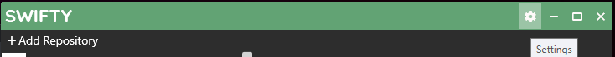
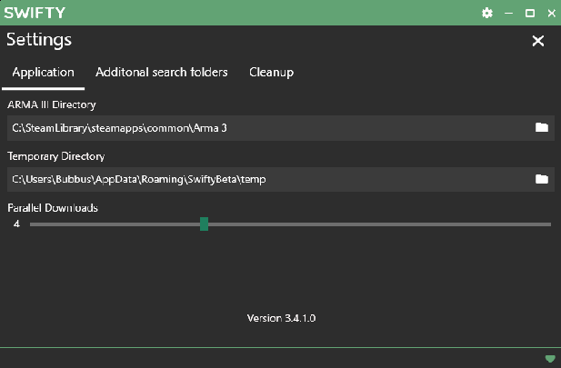
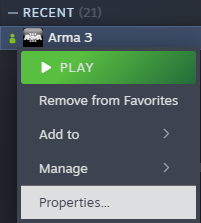
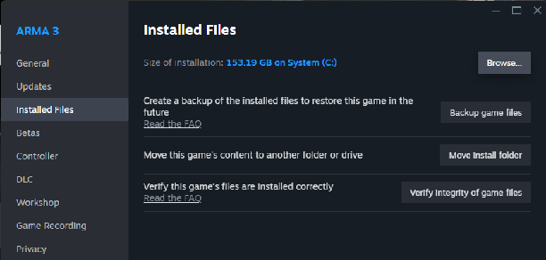

# How to Swifty

By Bubbus for CA 
With segments from the old guide by Starvolt. 

## Foreword (Why Swifty?)

Combined Arms uses Swifty instead of other approaches like Steam Workshop collections. While it’s easier to point people towards the Workshop, CA has been operating for a very long time now and has seen plenty of times where an Arma event would have had to be delayed or cancelled due to an unexpected mod update breaking the server, the mission file or both. Swifty allows us to control when mod updates happen, which means we never have any surprises.

In addition, we can run multiple mod-sets easily by separating them into different Swifty “repositories”. All of the mods can be installed into the same place so it doesn’t waste any of your storage space, and then they are all shared between our different mod-sets (Main, WW2, V+ etc).

We’ve been using Swifty since our group’s creation back in 2016 and have found it to be the best tool available so far for maintaining a complex mod-pack for a group of our size. The initial set-up can be a bit annoying but once it’s done, it’s done \- and this guide is here to help.

## Straightforward set-up guide

Swifty installation should normally be quite easy, but sometimes it can encounter some problems. The guide below will describe the ideal set-up process but if you have any problems following these instructions, you can check the [troubleshooting](#troubleshooting) section for advice.

1. Download the latest version of Swifty 3 from [getswifty.net](https://www.getswifty.net/) 

	!!! Note
		Make sure you get the Swifty Setup and not the “Swifty-cli”!

   { loading=lazy }

2. Run the ``Setup.exe`` (this will install and open Swifty). 

3. By default, Swifty will be empty. Open the Settings menu in Swifty by clicking the cog icon in the upper right of the window.

	

4. In the settings page, you can set the Arma 3 directory and a “Temporary directory”.

	The Arma 3 directory that you set here will be used by Swifty to find Arma and start the game with the right mods attached. If you need help finding the Arma 3 directory, follow the steps in the [find the Arma 3 directory](#find-the-arma-3-directory) section below.

	The “Temporary directory” is a place that Swifty will download mods into when it is updating: when the mods are fully downloaded then they are moved away into the proper place. Make sure that you have this directory somewhere with enough disk space.

	

Your Swifty is now configured and you can start adding mod-lists (aka “repositories”).

## Adding a new mod-list (aka ‘repository’)

1. Find the repository you want to add at [Repos & CDLC page](repos_cdlc.md) and copy the link, making sure to include the http://

2. In the main swifty window, click "Add Repository"

## Troubleshooting

### Find the Arma 3 directory

1. Find Arma 3 in your Steam library. You can right-click on it and go to “Properties”:

	

2. Once you’re there, you can click the “Installed Files” section in the left sidebar and then click the “Browse…” button on the right-hand side. This will open the Arma 3 folder and you can then copy the file-path from there and paste it into Swifty.

### 

### Helpful extra steps

If you’ve used Swifty previously, you’ll know that it installs into your appdata folder, rather than program files. At this stage, it’s a good idea to create a shortcut somewhere more accessible. The actual Swifty.exe can be found in your ``%appdata%\Local\Swifty3`` folder (to access this quickly you can enter “%appdata%” without the quotation marks into Windows Explorer, and then navigate up a level to take you to the Appdata folder).
