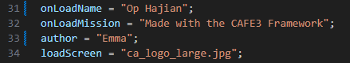
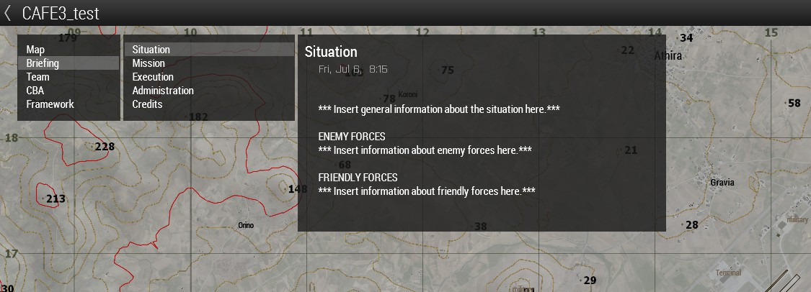

# Core Configuration

This guide will go over how to configure the critical framework settings for your mission. 

!!! Note
    You can find a video version of this guide [here](https://youtu.be/8wgFG25JnVc?t=152){target="_blank"}

## Open the mission folder in VS Code
1. The easiest way to edit the configuration is using [VS Code](https://code.visualstudio.com/){target="_blank"}.
2. Once you have VS Code installed and opened, add the [SQF Language extension](https://marketplace.visualstudio.com/items?itemName=vlad333000.sqf){target="_blank"} by Vladislav Sazonov.
3. Go to File>Open Folder, and select the mission folder, which should be in `Documents/Arma 3/mpmissions`. 

The mission folder contains all of the necessary files for the mission to run. 

You do not need to worry about most of the files, as they are there to make the mission run and are controlled by the configuration files.

## Configuring the Mission

### Description.ext

Description.ext contains the main information about the mission.

Edit the `onLoadName` and `author` lines to reflect the mission name and author you want displayed while the mission is loading.

You can edit the `loadScreen` line and replace it with an image you place in the mission directory. Compress this image, because it is sent to every player at once when the mission starts loading, so large images can put a heavy strain on the server.

<figure markdown="span">
    
    <figcaption>An example configuration of description.ext</figcaption>
</figure>

### The Configuration Folder

Most of the configuration takes place within the `configuration` folder. You do not need to look at any of the other folders. This guide will go through the critical configuration options. Treat it as a checklist to make sure you have configured all of the necessary elements. There are many more features in the framework, which you can learn about [here](optional_config.md).

#### Briefings

Briefings are the mission information the players can see at the top left of their map screen. 

<figure markdown="span" width=300>
    {width="600"}
    <figcaption>The default briefing tab</figcaption>
</figure>

Briefing configuration is in the `briefings` folder. There is one sqf file for each side, so make sure you are editing the correct one! west is BLUFOR, east is OPFOR, and resistance is INDFOR. 

The comments in each file give an example of how to create tasks to help the briefing, but they are not required.

You can replace any of the `*** Insert x here***` comments to edit the briefing. You can also delete any section you would like.

#### Identities

Identities are laid out in the `identities` folder, and enabled or disabled in `identityReplacement.hpp`. An identity controls what face, voice (including language), and name AI units receive. The main file you should look at is `identities/identityAssignment.sqf`. This file determines what identities are given to each side. 

You can find the possible identities in `identities/identityGroups.sqf`, where you can also add more identities if you would like. The identity name is the first argument in each `CREATE_IDENTITY()` command.

For example, you could change the OPFOR identity to Russian by setting the relevant line in `identityAssignment.sqf` to SET_FACTION_IDENTITY(opfor,russian). This will make all OPFOR AI speak Russian and have Russian names.

#### Loadouts

The `loadouts` folder controls the gear that can be assigned to each side by the gearscript. Gear is defined by the "roles" in each file. 