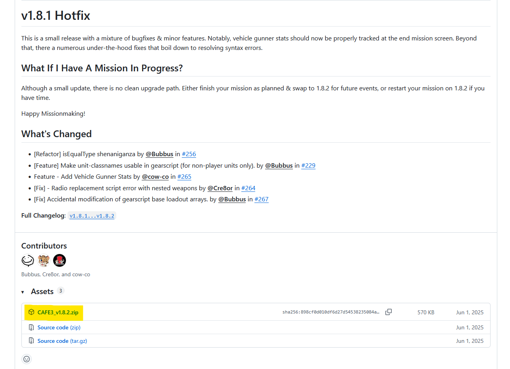
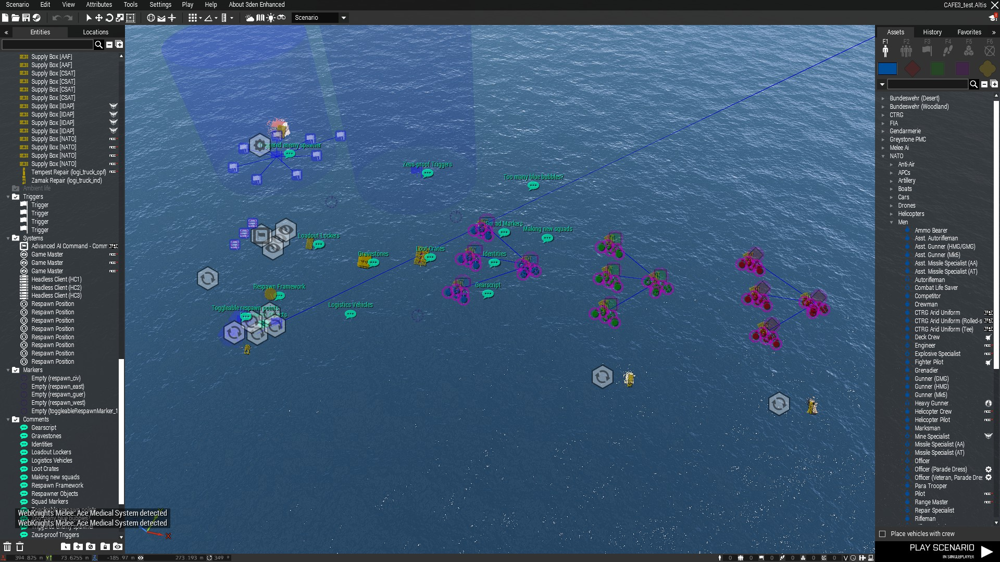

# Installing the Framework

!!! Note
    You can find a video version of this guide [here](https://youtu.be/8wgFG25JnVc){:target="_blank"}

1. Download the latest release from the [GitHub](https://github.com/CombinedArmsGaming/CAFE3/releases/latest){:target="_blank"}. Go to Assets, and then click the .zip file to download it.

<figure markdown="span">
  
</figure>

2. Move the zip to `Documents/Arma 3/mpmissions`. You can make a folder within `mpmissions` called something like `CA Missions` and put the zip there if you want to have more organization. 

3. Extract the zip file. Name the destination folder whatever you want your mission to be. In this guide, we will call it `CAFE3_Test`. 

4. Give the folder a "file extension" to let the editor know what map it is on. For example, to put this mission on Altis we would call the file `CAFE3_Test.Altis`. To get the extension for another map, open the editor on that map and save a new mission. This will create a folder with the extension you need.

5. You can now open the mission in the ARMA Eden Editor. Launch the editor on any map, and then click Scenario>Open in the toolbar. Navigate to the folder you extracted previously, and hit Open. 

You should now have the default framework mission open, as shown below.

<figure markdown="span">
    
</figure>

The default mission contains units and some of the framework features, so you can easily use or copy/paste whatever you need, and delete what you don't. It also contains comments to help with using some of the features, though they are also explained in these docs. 

Next, move on to [core configuration](core_configuration.md).